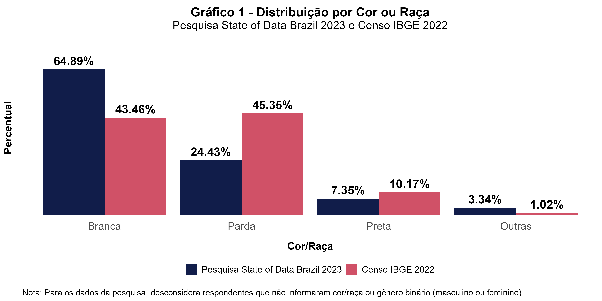

# Impacto da Desigualdade Racial - Pesquisa State of Data Brazil 2023

O objetivo deste estudo é analisar os impactos da desigualdade racial no setor de dados no Brasil, com base nas informações da pesquisa 'State of Data Brazil 2023'.
Os gráficos investigam a representação de pessoas negras na área, assim como as possíveis barreiras que esse grupo pode enfrentar. Alguns dados do IBGE
foram incorporados para proporcionar uma comparação mais detalhada e um entendimento mais profundo do problema.

## Sobre a Pesquisa State of Data Brazil 2023

A pesquisa “State of Data Brazil 2023” foi realizada pela Data Hackers e Bain & Company, com o intuito de investigar o mercado de trabalho
de dados no Brasil através da divulgação de um formulário online direcionado às pessoas da área, disponibilizado de 16/10/2023 à 06/12/2023.
A pesquisa contou com 5.293 participantes, que responderam perguntas sobre diferentes temas. Neste estudo, focaremos em analisar os dados demográficos e
de carreira para observar quais as diferenças que existem na jornada de pessoas negras na área de dados.

## Observações

Comparando os dados do Censo do IBGE de 2022 com os da pesquisa "State of Data Brazil 2023", percebemos que 
há uma notável sub-representação de pessoas negras na área de dados:

E, a partir dessa informação, observaremos outros indicadores que podem nos ajudar a construir uma percepção mais sólida
sobre as desigualdades raciais na área de dados, assim como os desafios que precisam ser enfrentados para alcançar um mercado de trabalho mais equitativo.
